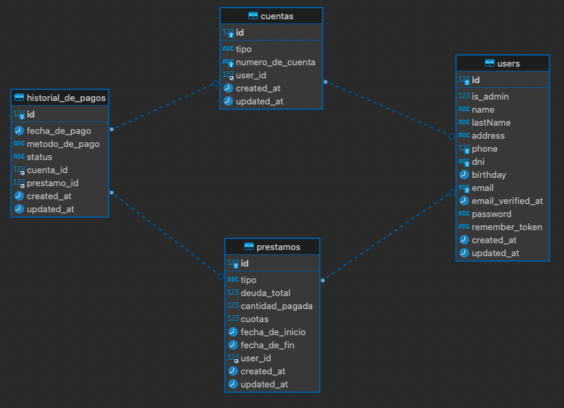
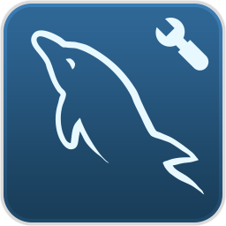

<a name="top"></a>
<h1 align ="center"> API Bank </h1>
<br>

<p align="center">
<a href="https://travis-ci.org/laravel/framework"></a>
<a href="https://packagist.org/packages/laravel/framework"></a>
<a href="https://packagist.org/packages/laravel/framework"></a>
<a href="https://packagist.org/packages/laravel/framework"></a>
</p>

# <p align ="center">Puesta en marcha</p>

## Configuracion inicial

En la raíz del proyecto debes encontrar el fichero `.env.example` que debe ser renombrado como `.env`

## Instalación de dependencias

El proyecto utiliza Docker. Las únicas dependencias son:

- `make`
- `docker`
- `docker-compose`

## Configuración de Docker

Para configurar Docker, simplemente ejecute el siguiente comando:

```bash
$ make up
```

## Para reestablecer los contenedores:

```bash
$ make down && make prune && make up
```

User `composer` y `php` a través de la consola:

## Laravel

```bash
$ make shell php

$ php -v
$ composer -v

# Set permissions to create logs
$ chmod -R 775 storage/*

# Install the PHP dependencies
$ composer install

# APP token:
$ php artisan key:generate

# If you want to remove the routes cache on your server
$ php artisan route:clear
# If you want to cache on your server
$ php artisan cache:clear
# If you want to clean views compilation
$ php artisan view:clear

# In case you want to exit the shell you just have to type
$ exit
```

# <h1 align ="center"> Index </h1>

- [¿Qué es? 🧐](#about)
- [Entidad Relación](#entidad)
- [Factories](#seed)
- [Requerimientos ⚙️](#requirements)
- [Tecnologías](#tecnol)

<a name="about"></a>
# <h1 align ="center"> ¿Qué es?  </h1>

Es una API REST privada creada con Laravel. Simula un sistema bancario básico donde los usuarios realizan diferentes operaciones, por ejemplo:

- Crear cuentas bancarias.
- Crear préstamos.
- Historial de pagos.
- Sistema seguro de login.
- Recuperación de contraseña. Para la recuperación de contraseña.

<a name="entidad"></a>
# <h1 align ="center"> Entidad Relación  </h1>

He creado tres tablas y las relacione junto con la tabla de usuarios. Solo los dueños de sus cuentas podrán acceder a su información, consigo esta autenticación por medio del sistema <b>Sanctum</b>.

Para poder crear una cuenta un préstamo o un historial de pagos, necesitas ser un administrador. En el archivo de rutas dejo credenciales de uno, para sus pruebas.



<a name="seed"></a>
# <p align ="center">Factoriyes - Seeds ⚒</p>
- Para generar datos aleatorios en la base de datos, he utilizado la libreria <b>Faker</b>. Para poder hacer uso de las <b>Factories</b>.
#### Implementación:
- [Crear usuarios, línea 23 a 37](database/factories/UserFactory.php).
- [Crear cuentas manteniendo la entidad referencial, línea 23 a 28](database/factories/CuentaFactory.php).
- [Instanciamos los modelos para poder hacer uso de las seeds, línea 17 a 20](database/seeders/DatabaseSeeder.php).


<br/>

<a name="tecnol"></a>
# <p align ="center">Tecnologías 💻</p>

<a href="https://git-scm.com/" target="_blank">  <a href="https://www.php.net/" target="_blank">  </a>   <a href="https://postman.com" target="_blank">  </a> </a>  </a>


[UP](#top)
